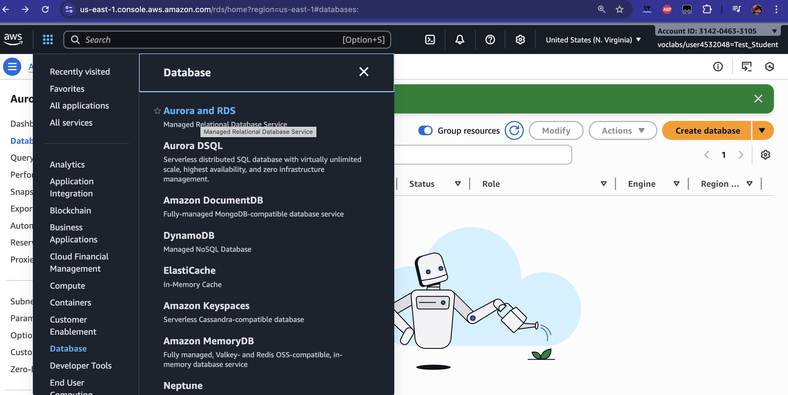
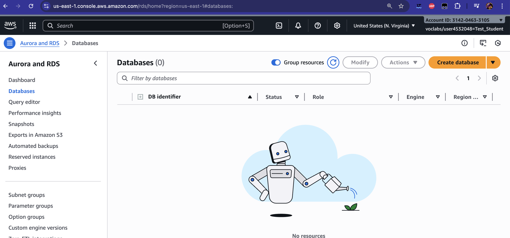
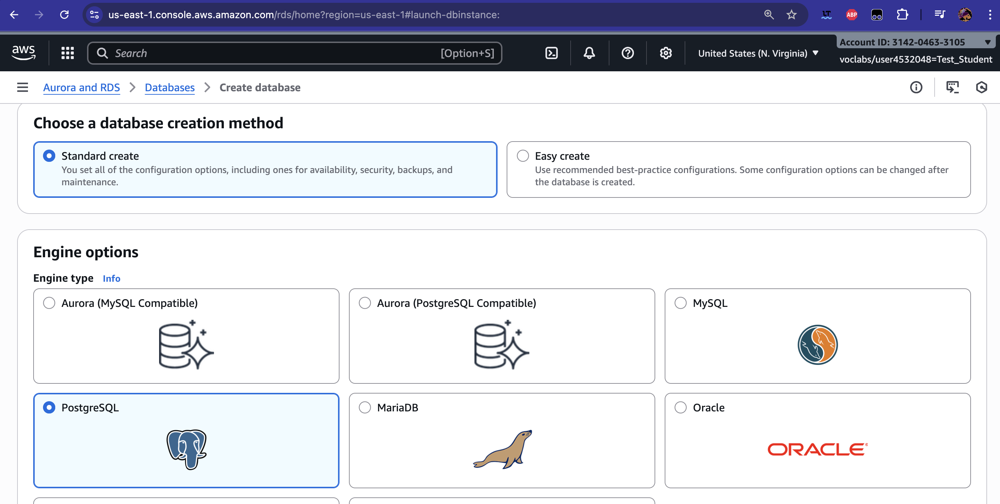
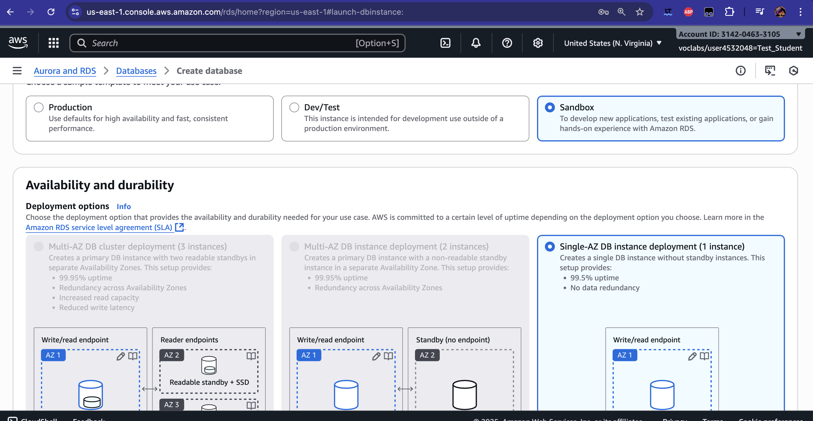
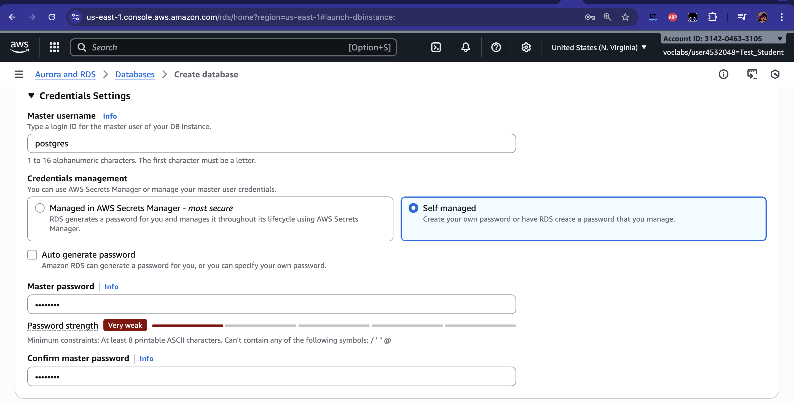
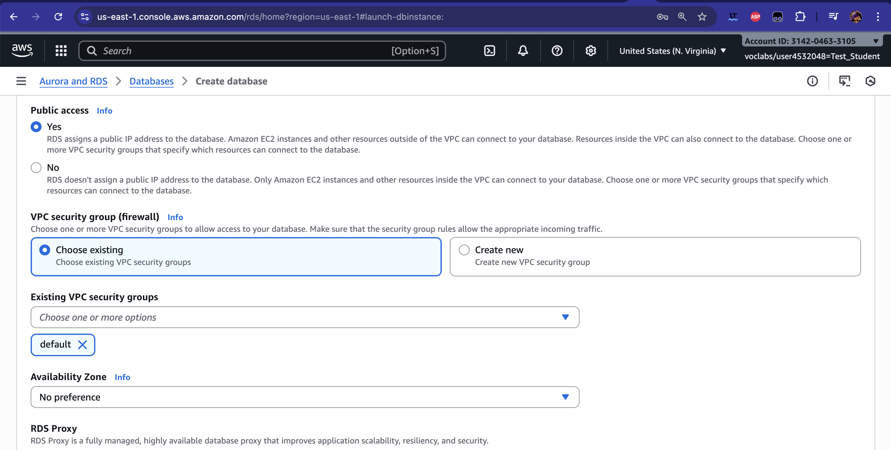
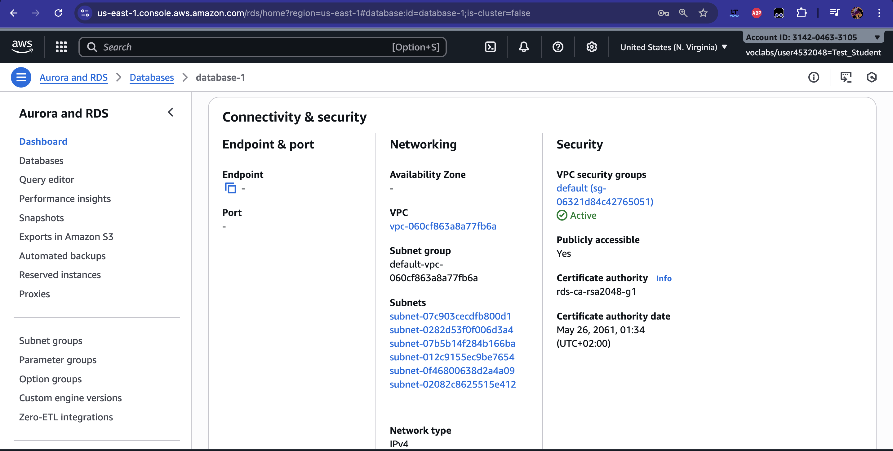
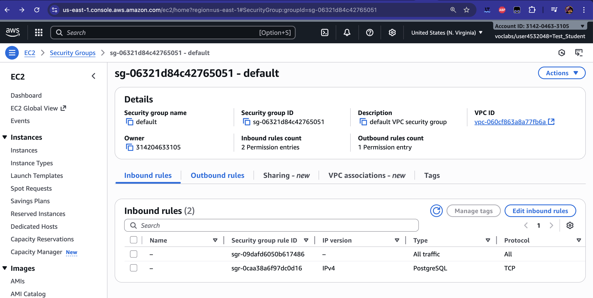

# AWS

## Crear base de dades

Cal crear una base de dades PostgreSQL a AWS

Aquest guia et mostra, pas a pas, com crear una instància d'Amazon RDS amb PostgreSQL perquè puguis practicar les consultes de SQL des del teu ordinador (DBeaver o psql).

### 1) Obrir RDS al console d'AWS

Al cercador de serveis, cerca «RDS» i entra a Amazon RDS (Aurora & RDS).



### 2) Crea una base de dades

Prem «Create database».



### 3) Tria el motor: PostgreSQL

Selecciona «Standard create» i com a motor «PostgreSQL».



### 4) Plantilla: Sandbox/Free tier

Tria la plantilla «Free tier» o «Dev/Test»/«Sandbox» per minimitzar costos. Deixa la versió per defecte.



### 5) Credencials de l'administrador

- DB instance identifier: un nom curt (p. ex. `pg-practiques`)
- Master username: `postgres` o un altre
- Master password: defineix una contrasenya segura i guarda-la



### 6) Connectivitat: accés públic temporal

Per practicar des del teu portàtil, activa «Public access: Yes». Més endavant, restringirem per IP via grup de seguretat.



### 7) Grup de seguretat (VPC security group)

Edita les regles d'entrada per permetre el port 5432 només des de la teva IP.



### 8) Regla d'entrada per al port 5432

- Type: PostgreSQL
- Port: 5432
- Source: Si poses `0.0.0.0/0` serà accessible des de tot Internet.



### 9) Crear i esperar el «Available»

Revisa la resta d'opcions en mode per defecte (emmagatzematge, monitoring desactivat) i prem «Create database». La creació pot trigar uns minuts.

Quan l'estat sigui «Available», obre els detalls de la instància i copia:

- Endpoint (host)
- Port (5432)
- Nom d'usuari (master)

### 10) Connectar-te des del teu equip

Pots utilitzar DBeaver (mira «Connectant-nos a la base de dades des de DBeaver» a Tema 1) o `psql`.

Paràmetres de connexió:

- Host: endpoint de l'RDS (p. ex. `pg-practiques.abc123xyz.eu-west-1.rds.amazonaws.com`)
- Port: 5432
- Database: `postgres` (o la que creïs)
- User: el «Master username» que vas definir
- Password: la teva contrasenya

Exemple amb psql (opcional):

```bash
psql "host=<endpoint> port=5432 dbname=postgres user=<usuari> password=<contrasenya> sslmode=require"
```

Si no pots connectar-te:

- Verifica que el SG permet la teva IP i el port 5432
- Comprova que «Public access» és «Yes» i que la instància és «Available»
- Reviseu que no hi hagi VPN/proxies bloquejant

### 11) Crear una base de dades i carregar dades

Des de dbeaver executarem els fitxers `*.sql` que trobem a `https://github.com/devrimgunduz/pagila`


### 12) Neteja i costos

Per evitar costos, quan acabis:

- Para la instància si no l'utilitzes (Stop)
- O elimina-la (Delete) marcant «Create final snapshot» només si necessites còpia
- Elimina grups de seguretat que ja no facis servir

Recorda: el Free tier té límits. Controla sempre l'ús per no generar càrrecs inesperats.
